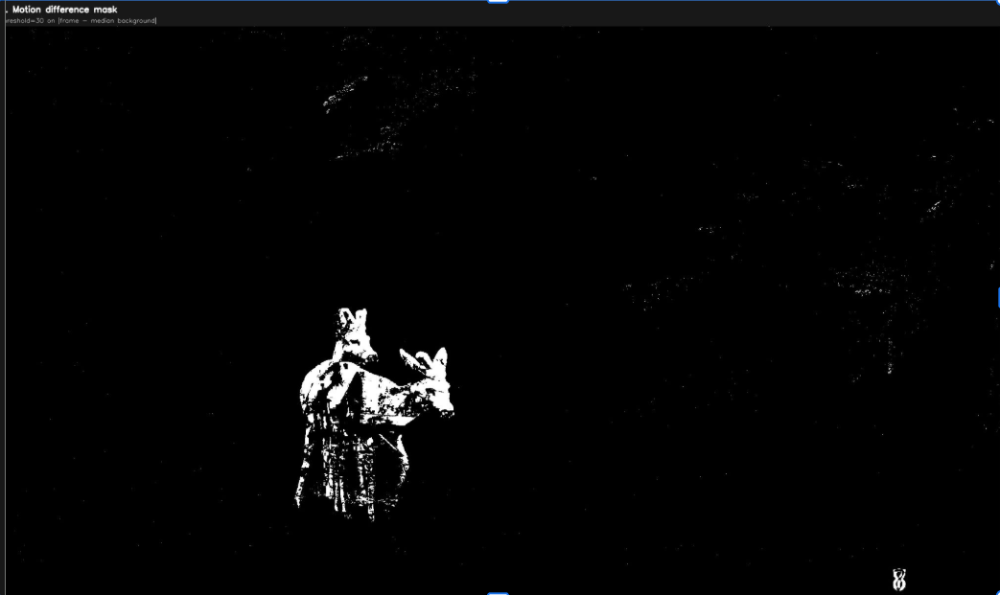
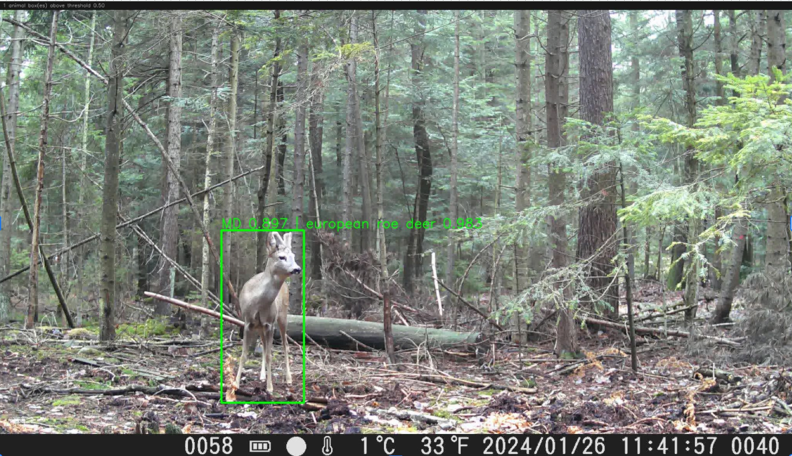

# Video Picker Dashboard (PyQt6 + uv)

An animal detection and classification dashboard. It scans folders for videos, identifies animals using **MegaDetector**, and classifies species with **SpeciesNet**. Results are stored in a local SQLite database for fast browsing and statistics.

## 🚀 Key Features
- **Folder-based Workflow:** Open a directory and see all videos at once.
- **Batch Processing:** Detect animals across multiple videos in the background.
- **SQLite Storage:** Results are saved in a hidden `.detections.db` inside each processed folder.
- **Interactive Statistics:** Folder-wide species distribution charts using `PyQt6.QtCharts`.
- **Enhanced Sidebar:** Sortable table showing detected animals and unique species counts.

## 🛠️ Setup

Ensure you have [uv](https://github.com/astral-sh/uv) installed.

1. **Install dependencies:**
   ```bash
   uv sync
   ```

2. **Download Models:**
   Place the following `.onnx` files into a `models/` directory in the project root:
   - `md_v5a_1_3_640_640_static.onnx` (MegaDetector)
   - `spicesNet_v401a.onnx` (SpeciesNet)

## 🏃 How to Run

Launch the dashboard with:
```bash
uv run python -m video_picker.app
```

## 🔄 Processing Pipeline

When you open a folder and run detection, each video goes through these steps:

<div align="center">

**1. Open folder** → **2. Sample & motion filter** → **3. MegaDetector** → **4. SpeciesNet** → **5. Browse results**

</div>

### 1. Open folder

Select a directory of trail-camera videos (`mp4`, `avi`, `mkv`, `mov`). The dashboard lists every video in that folder and prepares a local `.detections.db` for results.

### 2. Sample & motion filter

The worker reads the video at **~1 frame per second**. It builds a **median background** across those samples and keeps only frames where motion is strong enough to matter. Static scenes are skipped so detection runs on the interesting parts of each clip.

Motion is computed as `|frame − median background|` with a threshold of **30**; connected regions above a minimum area count as motion.



### 3. MegaDetector

Selected frames are preprocessed and batched through the **MegaDetector** ONNX model. The model returns animal bounding boxes and confidence scores for each sampled frame.

### 4. SpeciesNet

For each detection above the confidence threshold, the app crops the animal region and runs **SpeciesNet** to classify the species (for example, *european roe deer*). Detection and classification scores are stored together.



### 5. Browse results

Results are written to `.detections.db` in the opened folder. You can step through detected frames, inspect bounding boxes and species labels, and view folder-wide species distribution charts.

## 📂 Data Management
- **Database:** The app creates a `.detections.db` file in the folder you open. This contains all bounding boxes, species names, and timestamps.
- **Exporting:** You can still run the legacy batch script for images if needed:
  ```bash
  uv run python srctips/run_md_over_data_frames.py --data-dir ./my_images -b 8
  ```

## 🧩 Requirements
- Python >= 3.9
- PyQt6 & PyQt6-Charts
- OpenCV
- ONNX Runtime
- NumPy
